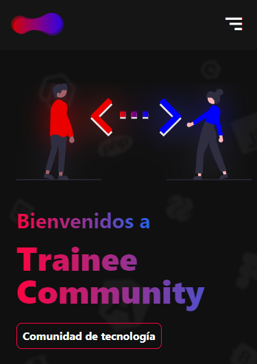

# TRAINEE COMMUNITY SITE WEB

## Tabla de Contenidos

- [Preview](#preview)
  - [Links](#links)
- [Proceso](#proceso)
  - [Construido con](#construido-con)
  - [Recursos Utilizados](#recursos-utilizados)

## Preview

### Screenshot

## Proyecto

Este proyecto fue realizado con la participación de los integrantes de OpenBootcamp, y es parte de una dinámica llamada "Weekend apps"

### Links

- Repositorio: [Solution](https://github.com/YhonaPeguero/Landing-Trainee-Community)
- Live Site URL: [Live App](https://trainee-community.netlify.app/)

## Proceso

### Construido con:

- Mobile-first workflow
- Responsive Design
- Flex Layout
- Html
- Tailwind

### Recursos Utilizados

- [Tailwind](https://tailwindcss.com/docs/)
- [MDN Web Docs](https://developer.mozilla.org/es/docs/Web)
